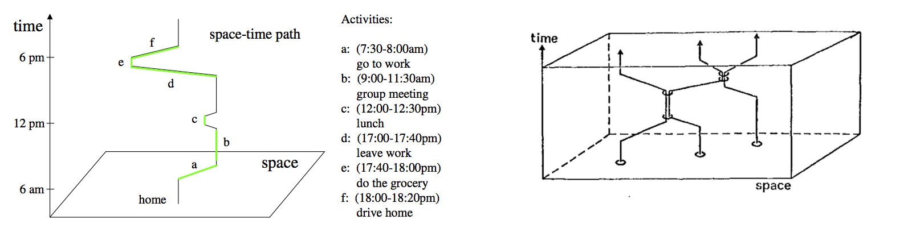
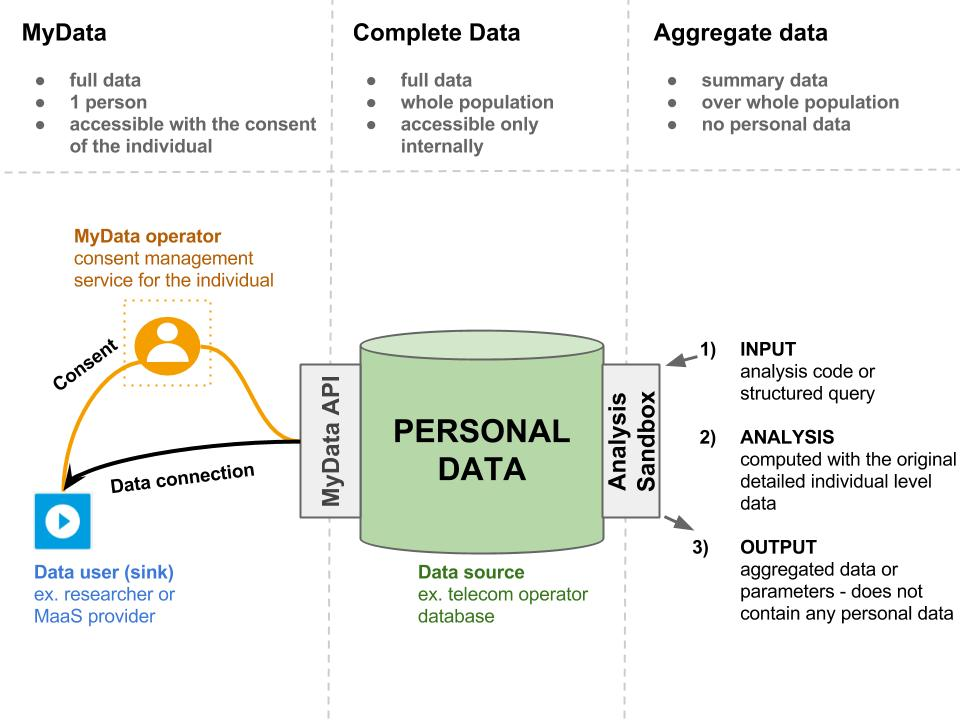

## Using individuals’ digital spatial footprint data in planning urban services

**Research plan for doctoral thesis [DRAFT 24.4.2015](#)**
Antti Poikola
Helsinki Institute for Information Technology
Espoo, Finland
antti.poikola@hiit.fi

*Text can be commented in [http://bit.ly/poikolaresearchplan](http://bit.ly/poikola_research_plan)*

### Abstract
My contribution is to develop methods for privacy aware collection and usage of individuals’ digital spatiotemporal footprint data inside the open science framework for reproducible urban science. I will study how the citizens' personal data can be used to observe the social interaction patterns in the cities and to inform planning and production of novel urban services such as personalized mobility. The global urbanization mega trend is underlining the need for quantitative and predictive urban theories that can assist in making the cities greener, safer and better places to live in. In recent years the quest for explanatory urban theory has sped up with hopes for using massive data sets from mobile phones and social media tools to reveal structure and dynamics of the human social networks in urban areas. Data is in the key role: it needs to be shared. Much of it can be found as open data, but perhaps the most important data sets belong to the domain of personal data, which by definition is not open and should be used only with the consent of the individual.

#### Human activity as the defining component of cities
The early 1960’s witnessed the appearance of works in urban theory that criticised earlier modernist planning practices for focusing mainly on aesthetics and form of city with no regard for social fabric that sustains urban development. In *“Death and Life of Great American Cities”* Jane Jacobs notes that cities are complex systems whose infrastructural, economic and social components are strongly interrelated and therefore difficult to understand in isolation (Jacobs, 1961). Alexander emphasised the relevance of social interactions as drivers of urban development and explicitly situated human activity as the defining component of cities (Alexander, 1965).

#### Scaling laws in cities
Despite their diversity the cities seem to manifest some universal, quantifiable features. Some features such as amount of housing naturally scale linearly with the population, but some features scale sub-linearly showing the *“economy of scale”* -effect. For example, doubling the population of any city requires only about an 85% increase in infrastructure, whether that be total road surface, length of electrical cables, water pipes or number of petrol stations. Interestingly the features that are connected to human social interaction seem to grow super-linearly with city size. On average, as city size increases, per capita socio-economic quantities such as wages, GDP, number of patents produced and number of educational and research institutions all increase by approximately 15% more than the expected linear growth. There is, however, a dark side: negative metrics including crime, traffic congestion and incidence of certain diseases all increase following the same 15% rule. Theoretical work suggests that the origin of this superlinear scaling pattern stems from the network of human interactions - in particular from increase in social connectivity per capita with city size. (Bettencourt and West, 2010)

In networks higher density of relationships (ties) facilitate the information flow and therefore it is suggested that population density, rather than population size would be at the root of the extraordinary nature of urban centers (Pan et al 2013). Population density is reasonably good proxy for the density of relationships which is harder to measure empirically. There is universal agreement on the fact that populations interact with one another less as the distance increases between them, but the exact relationship between these two variables is unclear (Scellato et al 2011). Denser urban areas (shorter distances between people and places) as well as better urban accessibility (less travel time also in the case of greater physical distances) make it easier and more probable to create relationships.

#### Science of social and spatial urban networks
Michael Batty argues that the networks of human interactions are considerably more important to our understanding and planning of cities than are locations (Batty, 2013). Both social networks and spatial location based networks can be analysed by applying the network theory (Barabási, 2002). In modern sociology analysing social relationships in terms of network theory has emerged a key technique.

In urban studies the network metaphor has a long tradition particularly when dealing with spatial networks such as transportation and mobility. After the seminal work of Hillier and Hanson (Hillier and Hanson, 1984), a rather consistent application of the network approach to cities, neighbourhoods, streets and even single buildings, has been developed under the notion of "space syntax", establishing a correlation between the topological accessibility of streets and phenomena as diverse as their popularity, human way-finding, safety against criminality, retail commerce vitality, activity separation and pollution. (Porta et al 2006)

In networks higher density of relationships (ties) facilitate the information flow and therefore it is suggested that population density, rather than population size would be at the root of the extraordinary nature of urban centers (Pan et al 2013). Population density is reasonably good proxy for the density of relationships which is harder to measure empirically. There is universal agreement on the fact that populations interact with one another less as the distance increases between them, but the exact relationship between these two variables is unclear (Scellato et al 2011). Denser urban areas (shorter distances between people and places) as well as better urban accessibility (less travel time also in the case of greater physical distances) make it easier and more probable to create relationships. What else contributes to the creation, number and quality of relationships? What kind of physical, social- and cultural arrangements and spaces bring people together and facilitate interaction? Is it possible to have really dense and busy streets that are actually poor in relationships?

#### Human activity as the defining component of cities
The early 1960’s witnessed the appearance of works in urban theory that criticised earlier modernist planning practices for focusing mainly on aesthetics and form of city with no regard for social fabric that sustains urban development. In *“Death and Life of Great American Cities”* Jane Jacobs notes that cities are complex systems whose infrastructural, economic and social components are strongly interrelated and therefore difficult to understand in isolation (Jacobs, 1961). Alexander emphasised the relevance of social interactions as drivers of urban development and explicitly situated human activity as the defining component of cities (Alexander, 1965).

#### Scaling laws in cities
Despite their diversity the cities seem to manifest some universal, quantifiable features. Some features such as amount of housing naturally scale linearly with the population, but some features scale sub-linearly showing the *“economy of scale”* -effect. For example, doubling the population of any city requires only about an 85% increase in infrastructure, whether that be total road surface, length of electrical cables, water pipes or number of petrol stations. Interestingly the features that are connected to human social interaction seem to grow super-linearly with city size. On average, as city size increases, per capita socio-economic quantities such as wages, GDP, number of patents produced and number of educational and research institutions all increase by approximately 15% more than the expected linear growth. There is, however, a dark side: negative metrics including crime, traffic congestion and incidence of certain diseases all increase following the same 15% rule. Theoretical work suggests that the origin of this superlinear scaling pattern stems from the network of human interactions - in particular from increase in social connectivity per capita with city size. (Bettencourt and West, 2010)

#### Science of urban networks
Michael Batty argues that the networks of human interactions are considerably more important to our understanding and planning of cities than are locations (Batty, 2013). Both social networks and spatial location based networks can be analysed by applying the network theory (Barabási, 2002). In modern sociology analysing social relationships in terms of network theory has emerged a key technique.

In urban studies the network metaphor has a long tradition particularly when dealing with spatial networks such as transportation and mobility. After the seminal work of Hillier and Hanson (Hillier and Hanson, 1984), a rather consistent application of the network approach to cities, neighbourhoods, streets and even single buildings, has been developed under the notion of "space syntax", establishing a correlation between the topological accessibility of streets and phenomena as diverse as their popularity, human way-finding, safety against criminality, retail commerce vitality, activity separation and pollution. (Porta et al 2006)

Network science can be used to study how ideas are flowing and how people are changing their behavior. Many aspects of human behavior are more related to the frequency of interaction and their position in the network than to the content of communication. In his book “Social physics” Pentland refers to Granovetter's well-known theory of weak ties (Granovetter, 1973). To get new ideas, you have to go outside your near community (strong ties) and meet different people in new situations (weak ties). People tend to bind strong ties to people who are similar and if you communicate only with similar people, same "truths" are circulated and repeated.

#### Time geography
It is important to recognize also the temporal dimension of human activities - even if the office employee and the night guard both frequent the same office building daily their paths may actually never intersect. Swedish geographers associated with Torsten Hägerstrand (1970) developed elegant conceptual framework called time geography and the concept of a space-time path to illustrate individual's activities and movements during a day. Space-time-path is a continuous sequence in three-dimensional space where x and y -axis are the location coordinates and the z axis represent time. When considering the social interaction and tie formation in cities it is interesting to study when and where people actually meet each others - where their space-time-paths intersect.

**Figure 1:** On the left space-time system and space-time-path of one individual (Chen et al 2011) and on the right space-time-paths of three individuals and meetings where two people are at the same place at the same time (after Hägerstrand).

#### Data driven research of social interaction in cities
In the contemporary society, our everyday activities create increasingly detailed digital traces scattered to databases managed by different organizations. This collection of digital records of personal data can be called "digital footprint", i.e. the trail of digital information created about us and by our actions. If this digital footprint is accessible in digitally digestible, machine-readable form it can be utilized to tell a lot about the behaviour, characteristics and preferences of an individual (Gencoglu et al 2015). There are two main classifications for digital footprints: passive digital footprints are collected without implicit and active involvement of data subject and active digital footprints that people deliberately create and share (Madden 2007).

Traditional methods for capturing social networks - for example through surveys - are for practical reasons often limited in scope. Availability of computational tools and large-scale data sets, such as those automatically collected from mobile phone networks and social media sites provide researchers and developers new perspectives on people's daily behavior. For example the time-geographic concepts such as space-time path can be examined at finer spatial and temporal resolution levels. Recently data driven approaches outside the computer science disciplines has gained popularity. Examples are computational sociology (Lazer et al 2009), social physics (Pentland, 2014) and digital humanities (Gold, 2012).

The data driven approaches open up possibilities for the systematic study of the urban social dynamics and organisation. The hope is that we can develop better cities and societies if we know better how people in fact behave; how they communicate, where they shop, how they move, where they meet each other etc. Central to the success of cities is the density of human interaction and how it facilitates the information flow and learning. As Edward Glaecer puts it “Cities enable the collaboration that makes humanity shine most brightly” (Glaecer, 2010).

### 2. Objectives and methods

My thesis will consist of four scientific articles in international peer-reviewed open access journals and a strong introduction. I will be the principal author in all papers. The papers respond to my principal research objective “Privacy aware use of digital footprint data in open and reproducible urban science”. The introduction summarizes the scientific findings and related business development experience where I apply the results to inform service production.

#### Objective 2: Privacy aware use of digital footprint data in open and reproducible urban science

Reproducibility -other experimenters are able to recompute the results- and replicability -others can achieve a consistent result- are two foundational characteristics of successful scientific research (Leeks 2015). The open science movement is driven by the recognition that reproducing and building on top of others research can be made more challenging by lack of access to published articles as well as analysis code and raw data (Whyte and Pryor, 2011). On the other hand, when barriers are broken down, great progress can be made rapidly. For example, the Human Genome Project is a clear demonstration of open sharing of data leading to incredible advances in biology in short time and huge economic benefits (Tripp & Grueber, 2011). Many funders, publishers, scientists, and other stakeholders in research are calling for more research data to be made openly available in order to increase transparency, reproducibility and efficiency of the scientific process (Molloy, 2011). There is also evidence that stakeholders and the public are much more likely to accept scientific findings and policy decisions when they know that the results have been vetted through a transparent, open process (Dietz and Stern 2008).

Usual barriers in making research data publicly available are technological —particularly when the data are heterogeneous and not standardized and lack of incentives for individuals to share data (Reichman et al. 2011). Online data repositories, metadata standards, journals devoted to publishing data, and new measures of impact are being developed to overcome these barriers and in some disciplines, such as meteorology, astronomy and biology there has already been a shift in the norms toward sharing data (Soranno et al 2015).

Even if the above mentioned barriers can be overcome in the future big part of the scientifically interesting data can never be open since it is originated from individuals and therefore personal and private by nature. In urban science personal data such as mobile phone data offer vast opportunities for understanding social interaction in cities, but there are sticky legal and ethical issues around the privacy and consent of research subjects. In many cases privacy issues are structural - one can not study society without studying people at some level. Furthermore, some of the most scientifically valuable data are proprietary (e.g., mobile phone and financial transactional data). Robust models of collaboration and data sharing between industry such as tele operators and the academy need to be developed; guarding both the privacy of individuals as well as corporations' legitimate interests (Lazer et al 2009).

At HIIT there is on going research focusing on human centered data sharing and management model called MyData. The key idea is that every individual should be able to access, use and control all personal data collected about them and if they wish delegate this data to other organisations and applications for legal use (Poikola et al 2014). There is evidence that people will voluntarily give up their data if they can see a personal or societal benefit in it (Frost and Massagli 2008).

**Figure 2:** Suggested models for sustainable use of personal data in research - (middle) database of personal data of many individuals hosted by an organization such as teleoperator, the whole database is accessible only internally by the organization (left) individual has access to her own data via MyData API and she can consent and direct it to external data user such as Mobility as a Service (MaaS) -provider or donate to research purposes (right) researchers can send analysis code to be run in a safe sandbox where the results are computed with the raw data of multiple individuals but only non-personal aggregated summary data is sent out for the researcher.

> **Paper 1: Individual's spatiotemporal digital footprint as a source for information in planning mobility services**
*I examine the state-of-the-practice of collecting individual's spatiotemporal digital footprint data for research purposes. What kind of digital footprint data is created in different registries, online services etc. about test subjects (young urban adults living in the Helsinki metropolitan area), and how it could be used in planning novel mobility services? The focus is in gaining coverage of as many typical registry data sets as possible where the data includes both spatial and temporal component. I evaluate the characteristics, quality, potential utility and related barriers of use of different data sources.*

> **Paper 2: Digital footprint data and privacy in urban studies**
*I look at the potential use cases of spatiotemporal digital footprint data in urban studies and the issues of making such data available to third-party applications and research without compromising the privacy of the individual. What are the different requirements (temporal and spatial accuracy, real-time, individual level vs. aggregate etc.) when the data is used for example to open reproducible science, operational service planning and -production or decision making? I represent two related models - the analysis sandbox -model for doing aggregate level analysis on large databases of personal data (ex. mobile location data collected by the tele operators) and the MyData -model, where the individual explicitly consents her data to be used by third-party applications or researchers.*

> **Paper 3: Generating individual space-time-paths from digital footprint data**
*Continuous location data such as GPS tracking data alone provides useful information of where and when people are located, but does not indicate why people are at particular locations at certain times. In this paper I study the possibility to generate individual space-time-paths from GPS tracking data enriched with other automatically recorded digital footprint data such as social media services, loyalty cards, payment transactions, mobile phone usage etc.*

>**Paper 4: City as a platform for creating social connections**
*An important benefit of cities is that they enhance the idea flow by bringing people together and facilitating interaction between groups and individuals with diverse backgrounds. On the other hand inside cities the residential areas are often (to some degree) segregated which may decrease the likelihood of connections between dissimilar people. Based on individuals' mobility patterns I will analyse what kind of physical, social- and cultural arrangements and spaces in the city of Helsinki support mixing of residents from different areas.*

#### Objective 2: Actionable tools to urban planning and service production

How scientific knowledge on human interaction in cities can be put into practice in reality? A longstanding preoccupation of urban researchers has been the utility of research to inform real life situations in urban planning, decision making and service production. Accurate and timely data streams can be used to inform decisions related to urban service production such as planning the public transport routes based on mobile phone location data (Townsend 2013) and finding the best locations for bike-share docking stations based on the automatically collected bike usage data (O’Brien 2014). However, evidence-based practice (Krizek et al. 2009) approaches are not easy to implement in cities’ complex political and economical reality where decision making processes usually involve many individuals and groups with different opinions.

In order to have an impact, scientific findings need to be polished to the level of understandable tools and concepts that the citizens, decision makers and planners are able and willing to use. The final productization of such tools is non-academic activity best accomplished by private businesses or nonprofits.

As part of my doctoral studies I will apply to the EIT ICT Labs Innovation and entrepreneurship (I&E) program for doctoral students which includes minimum six months’ business development experience in a company. During the business development experience I will bring results and methods of the earlier papers to inform service production. I will summarize the experiences and gained insights into the introductory part of my dissertation.

### 3. Ethical questions
The use of large data sets and social network analysis in urban research raises important questions about ethics and privacy. Protecting privacy of individuals is even more challenging when the aim is to create reproducible open science, which means publishing also the research data openly. Central part of my dissertation (My Data) focuses on ethically sustainable and privacy aware way of using personal data for research.

Other perhaps less prominent ethical questions relate to the outcomes of the research. Anthony M. Townsend warns about technology enthusiasm by reminding how in the 1930s modernist planners began rebuilding cities around a new technology, the automobile, without considering the potential negative effects. Today the “Data enthusiasm” is fueling the new scientific interest in cities. But even the biggest urban datasets are likely to prove incomplete and trying to understand the behaviour of something as complex as a city solely by computing large masses of data may not lead to best outcomes. (Townsend, 2013)

It is crucially important to set question right - what do we want to optimise in a city? Gains in efficiency often lead to “rebound” consumption. For example the cities may be greener since they offer a means of living that involves less driving and smaller homes to heat and cool (Glaeser, 2011), but at the same time city dwellers are earning more and consuming other goods more which may cancel the positive “green” effect.

### 4. Research environment and schedule

Principal supervisor for my thesis will be Ph.D. Tuuli Toivonen (*[Helsinki University](http://www.helsinki.fi/geo/)*) who has great expertise of the topics covered in this research. Ph.D. Marko Turpeinen ([*HIIT*](http://hiit.fi/)) will be thesis advisor monitoring the progress of my PhD dissertation and studies.

I plan to join *[DENVI](http://www.helsinki.fi/henvi/denvi/)* (Doctoral Program in interdisciplinary Environmental sciences) as my postgraduate school after I have received a right to pursue PhD studies at the University of Helsinki. I will be working tightly in two research groups, one at the Helsinki University Division of Urban Geography and Regional Studies, and the other one at HIIT (*[Digital Content Communities group](http://www.hiit.fi/digital-content-communities)*). I believe that these interdiciplinary networks give me valuable support during the process of PhD studies.

Funding for this research is fully granted for the year of 2015 from two TEKES projects namely: *[Digital Health Revolution](www.digitalhealthrevolution.fi/)* and *[Revolution of Knowledge Work](http://reknow.fi/)*. Further funding for my PhD studies will be applied later on.

Before starting my dissertation I have worked in developing solutions for the open collaboration between citizens and the public sector organizations. I am well connected in Open Data, Open Science and My Data movements in Finland and elsewhere. The city as a context is my passion and underlying motivation for PhD studies.

*Table 1: Preliminary schedule of completing PhD dissertation*

|                                                       | 2015 | 2016 | 2017 | 2018 | 2019 |
|-------------------------------------------------------|:----:|:----:|:----:|:----:|:----:|
| Pre-analysis and specifying the research proposal     |   X  |      |      |      |      |
| Paper I                                               |   X  |   X  |      |      |      |
| Paper II                                              |   X  |   X  |      |      |      |
| Paper III                                             |      |   X  |   X  |      |      |
| Research exchange                                     |      |      |   X  |      |      |
| Paper IV                                              |      |      |   X  |   X  |      |
| Business development experience                       |      |      |      |   X  |      |
| Finalising the dissertation                           |      |      |      |   X  |   X  |

*Table 2:Preliminary study plan*

|                                                               | Credits |  Code  |  Year  |
|---------------------------------------------------------------|:-------:|:------:|:------:|
| Research Funding and Impact                                   | 2       | 929101 | 2015   |
| Research Ethics                                               | 3       | 50067  | 2015   |
| Scientific Writing                                            | 2       | 50065  | 2015   |
| Conference presentation                                       | 2       | 50066  | 2016   |
| Comparative Urban Research                                    | 5       |        | 2016   |
| Social Networks Analysis for Communication Networks           | 4       |        | 2016   |
| City and Culture                                              | 5       |        | 2016   |
| Data Science Specialization on Coursera (a)                   | 10      |        | 2016   |
| EIT ICT Labs Innovation and entrepreneurship program (b)      | 30      |        | 2017-2019 |

(a) [Data Science Specialization on Coursera](https://www.coursera.org/specialization/jhudatascience/1) offered by Johns Hopkins University on Coursera consists of eight MOOC courses and a Capstone project where students will apply the learned skills. Specialization courses are: *The Data Scientist’s Toolbox, R Programming, Getting and Cleaning Data, Exploratory Data Analysis, Reproducible Research, Statistical Inference, Regression Models, Practical Machine Learning, Developing Data Products, Data Science Capstone*.

(b) [EIT ICT Labs Innovation and entrepreneurship program](http://doctoralschool.eitictlabs.eu/ie-education/) is composed of four intensive business competence courses courses, six months’ researcher exchange and six months’ business development experience. EIT ICT Labs combines education, research and business in thematic areas, called action lines. Thematically my doctoral thesis is well aligned with the action line Urban Life & Mobility.

### 5. References

**Ahas**, Rein, Anto Aasa, Siiri Silm, and Margus Tiru. 2010. “Daily Rhythms of Suburban Commuters’ Movements in the Tallinn Metropolitan Area: Case Study with Mobile Positioning Data.” Transportation Research Part C: Emerging Technologies 18 (1): 45–54.

**Barabási**, Albert-László. 2002. Linked: The New Science of Networks. Perseus Books Group.

**Barbosa**, Luciano, Kien Pham, Claudio Silva, Marcos R. Vieira, and Juliana Freire. 2014. “Structured Open Urban Data: Understanding the Landscape.” Big Data 2 (3): 144–54.

**Batty**, Michael. 2013. The New Science of Cities. Mit Press.

**Bettencourt**, Luis, and Geoffrey West. 2010. “A Unified Theory of Urban Living.” Nature 467 (7318): 912–13. doi:10.1038/467912a.

**Chen**, Jie, Shih-Lung Shaw, Hongbo Yu, Feng Lu, Yanwei Chai, and Qinglei Jia. 2011. “Exploratory Data Analysis of Activity Diary Data: A Space–time GIS Approach.” Journal of Transport Geography 19 (3): 394–404.

**Frost**, Jeana H., and Michael P. Massagli. 2008. “Social Uses of Personal Health Information within PatientsLikeMe, an Online Patient Community: What Can Happen When Patients Have Access to One Another’s Data.” Journal of Medical Internet Research 10 (3).

**Gonzalez**, Marta C., Cesar A. Hidalgo, and Albert-Laszlo Barabasi. 2008. “Understanding Individual Human Mobility Patterns.” Nature 453 (7196): 779–82.

**Gencoglu**, Oguzhan, Heidi Similä, Harri Honko, and Minna Isomursu. 2015. “Collecting a Citizen’s Digital Footprint for Health Data Mining,” (submitted for publication).

**Glaeser**, Edward. 2011. Triumph of the City: How Our Greatest Invention Makes Us Richer, Smarter, Greener, Healthier, and Happier. Penguin Group US.

**Granovetter**, Mark S. 1973. “The Strength of Weak Ties.” American Journal of Sociology, 1360–80.

**Hägerstrand**, Torsten. 1970. “What about People in Regional Science?” Papers of the Regional Science Association 24 (1): 6–21. doi:10.1007/BF01936872.

**Jacobs**, Jane. 1961. The Death and Life of Great American Cities. Vintage Books.

**Krizek**, Kevin, Ann Forysth, and Carissa Schively Slotterback. 2009. “Is There a Role for Evidence-Based Practice in Urban Planning and Policy?” Planning Theory & Practice 10 (4): 459–78.

**Lazer**, David, Alex (Sandy) Pentland, Lada Adamic, Sinan Aral, Albert Laszlo Barabasi, Devon Brewer, Nicholas Christakis, et al. 2009. “Life in the Network: The Coming Age of Computational Social Science.” Science (New York, N.Y.) 323 (5915): 721–23. doi:10.1126/science.1167742.

**Leek**, Jeffrey T., and Roger D. Peng. 2015. “Opinion: Reproducible Research Can Still Be Wrong: Adopting a Prevention Approach.” Proceedings of the National Academy of Sciences 112 (6): 1645–46. doi:10.1073/pnas.1421412111.

**Louail**, Thomas, Maxime Lenormand, Oliva García Cantú, Miguel Picornell, Ricardo Herranz, Enrique Frias-Martinez, José J. Ramasco, and Marc Barthelemy. 2014. “From Mobile Phone Data to the Spatial Structure of Cities.” arXiv:1401.4540 [physics](#), January. http://arxiv.org/abs/1401.4540.

**Madden**, M., S. Fox, A. Smith, and J. Vitak. 2007. Digital Footprints: Online Identity Management and Search in the Age of Transparency. Pew Internet and American Life Project.

**Molloy**, Jennifer C. 2011. “The Open Knowledge Foundation: Open Data Means Better Science.” PLoS Biology 9 (12). doi:10.1371/journal.pbio.1001195.

**O’Brien**, Oliver, James Cheshire, and Michael Batty. 2014. “Mining Bicycle Sharing Data for Generating Insights into Sustainable Transport Systems.” Journal of Transport Geography 34 (January): 262–73. doi:10.1016/j.jtrangeo.2013.06.007.

**Pan**, Wei, Gourab Ghoshal, Coco Krumme, Manuel Cebrian, and Alex Pentland. 2013. “Urban Characteristics Attributable to Density-Driven Tie Formation.” Nature Communications 4 (June). doi:10.1038/ncomms2961.

**Pentland**, Alex. 2014. Social Physics: How Good Ideas Spread-The Lessons from a New Science. Penguin.

**Poikola**, Antti, Kai Kuikkaniemi, and Ossi Kuittinen. 2014. My Data - Johdatus Ihmiskeskeiseen Henkilötiedon Hyödyntämiseen. Ministry of Transport and Communications. http://urn.fi/URN:ISBN:978-952-243-418-0.

**Porta**, Sergio, Paolo Crucitti, and Vito Latora. 2006. “The Network Analysis of Urban Streets: A Primal Approach.” Physica A: Statistical Mechanics and Its Applications 369 (2): 853–66. doi:10.1016/j.physa.2005.12.063.

**Reichman**, O. J., Matthew B. Jones, and Mark P. Schildhauer. 2011. “Challenges and Opportunities of Open Data in Ecology.” Science 331 (6018).

**Scellato**, Salvatore, Anastasios Noulas, Renaud Lambiotte, and Cecilia Mascolo. 2011. “Socio-Spatial Properties of Online Location-Based Social Networks.” ICWSM 11: 329–36.

**Schläpfer**, Markus, Luis M. A. Bettencourt, Sebastian Grauwin, Mathias Raschke, Rob Claxton, Zbigniew Smoreda, Geoffrey B. West, and Carlo Ratti. 2012. “The Scaling of Human Interactions with City Size.” arXiv:1210.5215 [physics](#), October. http://arxiv.org/abs/1210.5215.

**Soranno**, Patricia A., Kendra S. Cheruvelil, Kevin C. Elliott, and Georgina M. Montgomery. 2015. “It’s Good to Share: Why Environmental Scientists’ Ethics Are Out of Date.” BioScience 65 (1): 69–73. doi:10.1093/biosci/biu169.

**Stern**, Paul C., and Thomas Dietz. 2008. Public Participation in Environmental Assessment and Decision Making. National Academies Press.

**Townsend**, Anthony M. 2013. Smart Cities: Big Data, Civic Hackers, and the Quest for a New Utopia. WW Norton & Company.

**Tripp**, S., and M. Grueber. 2011. “Economic Impact of the Human Genome Project.” Battelle Memorial Institute.

**Whyte**, Angus, and Graham Pryor. 2011. “Open Science in Practice: Researcher Perspectives and Participation.” International Journal of Digital Curation 6 (1): 199–213. doi:10.2218/ijdc.v6i1.182.