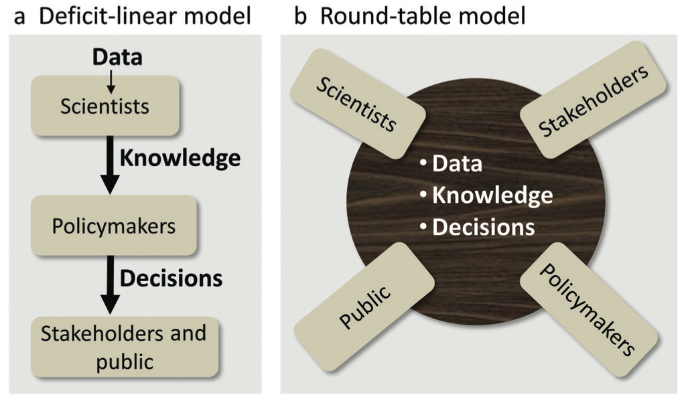

## Sustainable use of personal data in urban studies
Open science approach for supporting evidence-based urban planning and decision making.

**Research plan for doctoral thesis [DRAFT 25.3.2015](#)**
Antti Poikola
Helsinki Institute for Information Technology
Espoo, Finland
antti.poikola@hiit.fi

*Text can be commented in [http://bit.ly/poikolaresearchplan](http://bit.ly/poikola_research_plan)*

### Abstract
My contribution is to first develop methods for privacy aware and sustainable usage of personal data inside the open science framework for reproducible urban science and then taking the data into action in urban planning and policy. The complexity and diversity of cities and the hard to measure human social interactions in the cities makes it a daunting task for the scientific community to develop integrated, quantitative and predictive urban theory. In recent years the quest for explanatory urban theory has sped up with hopes for using massive data sets from mobile phones and social media tools to reveal structure and dynamics of the human social networks in urban areas. The unified theory of cities is still far from being complete and more comparative studies are needed to verify and reproduce the findings. Data is in the key role: it needs to be shared. Much of it can be found as open data, but perhaps the most important data sets belong to the domain of personal data, which by definition is not open and should be used only with the consent of the individual.

#### Human activity as the defining component of cities
The early 1960’s witnessed the appearance of works in urban theory that criticised earlier modernist planning practices for focusing mainly on aesthetics and form of city with no regard for social fabric that sustains urban development. In *“Death and Life of Great American Cities”* Jane Jacobs notes that cities are complex systems whose infrastructural, economic and social components are strongly interrelated and therefore difficult to understand in isolation (Jacobs, 1961). Alexander emphasised the relevance of social interactions as drivers of urban development and explicitly situated human activity as the defining component of cities (Alexander, 1965).

#### Scaling laws in cities
Despite their diversity the cities seem to manifest some universal, quantifiable features. Some features such as amount of housing naturally scale linearly with the population, but some features scale sub-linearly showing the *“economy of scale”* -effect. For example, doubling the population of any city requires only about an 85% increase in infrastructure, whether that be total road surface, length of electrical cables, water pipes or number of petrol stations. Interestingly the features that are connected to human social interaction seem to grow super-linearly with city size. On average, as city size increases, per capita socio-economic quantities such as wages, GDP, number of patents produced and number of educational and research institutions all increase by approximately 15% more than the expected linear growth. There is, however, a dark side: negative metrics including crime, traffic congestion and incidence of certain diseases all increase following the same 15% rule. Theoretical work suggests that the origin of this superlinear scaling pattern stems from the network of human interactions - in particular from increase in social connectivity per capita with city size. (Bettencourt and West, 2010)

#### Science of urban networks
Michael Batty argues that the networks of human interactions are considerably more important to our understanding and planning of cities than are locations (Batty, 2013). Both social networks and spatial location based networks can be analysed by applying the network theory (Barabási, 2002). In modern sociology analysing social relationships in terms of network theory has emerged a key technique.

In urban studies the network metaphor has a long tradition particularly when dealing with spatial networks such as transportation and mobility. After the seminal work of Hillier and Hanson (Hillier and Hanson, 1984), a rather consistent application of the network approach to cities, neighbourhoods, streets and even single buildings, has been developed under the notion of "space syntax", establishing a correlation between the topological accessibility of streets and phenomena as diverse as their popularity, human way-finding, safety against criminality, retail commerce vitality, activity separation and pollution. (Porta et al 2006)

In networks higher density of relationships (ties) facilitate the information flow and therefore it is suggested that population density, rather than population size would be at the root of the extraordinary nature of urban centers (Pan et al 2013). Population density is reasonably good proxy for the density of relationships which is harder to measure empirically. There is universal agreement on the fact that populations interact with one another less as the distance increases between them, but the exact relationship between these two variables is unclear (Scellato et al 2011). Denser urban areas (shorter distances between people and places) as well as better urban accessibility (less travel time also in the case of greater physical distances) make it easier and more probable to create relationships. What else contributes to the creation, number and quality of relationships? What kind of physical, social- and cultural arrangements and spaces bring people together and facilitate interaction? Is it possible to have really dense and busy streets that are actually poor in relationships?

#### Data driven research of social interaction in cities
In the contemporary society, our everyday activities create increasingly detailed digital traces scattered to databases managed by different organizations. This collection of digital records of personal data can be called "digital footprint", i.e. the trail of digital information created about us and by our actions. This digital footprint can tell a lot about the behaviour, characteristics and preferences of an individual and, provided it's accessible in digitally digestible, machine-readable form (Gencoglu et al 2015). There are two main classifications for digital footprints: passive digital footprints are collected without implicit and active involvement of data subject and active digital footprints that people deliberately create and share (Pew 2007).

Traditional methods for capturing social networks - for example through surveys - are for practical reasons often limited in scope. Availability of computational tools and large-scale data sets, such as those automatically collected from mobile phone networks and social media sites provide researchers and developers new perspectives on people's daily behavior. Recently data driven approaches outside the computer science disciplines has gained popularity. Examples are computational sociology (Lazer et al 2009), social physics (Pentland, 2014) and digital humanities (Gold, 2012). 

Data driven approaches and network science can be used to study how ideas are flowing and how people are changing their behavior. Many aspects of human behavior are more related to the frequency of interaction and their position in the network than to the content of communication. In his book “Social physics” Pentland refers to Granovetter's well-known theory of weak ties (Granovetter, 1973). To get new ideas, you have to go outside your near community (strong ties) and meet different people in new situations (weak ties). People tend to bind strong ties to people who are similar and if you communicate only with similar people, same "truths" are circulated and repeated.

The data driven approaches open up possibilities for the systematic study of the urban social dynamics and organisation. The hope is that we can develop better cities and societies if we know better how people in fact behave; how they communicate, where they shop, how they move, where they meet each other etc. Central to the success of cities is the density of human interaction and how it facilitates the information flow and learning. As Edward Glaecer puts it “Cities enable the collaboration that makes humanity shine most brightly” (Glaecer, 2010).

### 2. Objectives and methods

My thesis will consist of a summary and five scientific articles in international peer-reviewed journals. I will be the principal author in most of the papers. The planned papers are divided in groups based on their objectives.

#### Objective 1: Privacy aware use of personal data in open and reproducible urban science

Reproducibility -other experimenters are able to recompute the results- and replicability -others can achieve a consistent result- are two foundational characteristics of successful scientific research (Leeks 2015). The open science movement is driven by the recognition that reproducing and building on top of others research can be made more challenging by lack of access to published articles as well as analysis code and raw data (Whyte and Pryor, 2011). On the other hand, when barriers are broken down, great progress can be made rapidly. For example, the Human Genome Project is a clear demonstration of open sharing of data leading to incredible advances in biology in short time and huge economic benefits (Tripp & Grueber, 2011). Many funders, publishers, scientists, and other stakeholders in research are calling for more research data to be made openly available in order to increase transparency, reproducibility and efficiency of the scientific process (Molloy, 2011).

Usual barriers in making research data publicly available are technological —particularly when the data are heterogeneous and not standardized and lack of incentives for individuals to share data (Reichman et al. 2011). Online data repositories, metadata standards, journals devoted to publishing data, and new measures of impact are being developed to overcome these barriers and in some disciplines, such as meteorology, astronomy and biology there has already been a shift in the norms toward sharing data (Soranno et al 2015).

Even if the above mentioned barriers can be overcome in the future big part of the scientifically interesting data can never be open since it is originated from individuals and therefore personal and private by nature. In urban science personal data such as mobile phone data offer vast opportunities for understanding social interaction in cities, but there are sticky legal and ethical issues around the privacy and consent of research subjects. In many cases privacy issues are structural - one can not study society without studying people at some level. Furthermore, some of the most scientifically valuable data are proprietary (e.g., mobile phone and financial transactional data). Robust models of collaboration and data sharing between industry such as tele operators and the academy need to be developed; guarding both the privacy of individuals as well as corporations' legitimate interests (Lazer et al 2009).

At HIIT there is on going research focusing on MyData, which is human centric approach on personal data management. It basically refers to a data infrastructure where people have accounts that contain information about all their data sources (hosted by different organisations) and rules on how individual allows delegating this data to other organisations and applications for legal use. There is evidence that people will voluntarily give up their data if they can see a personal or societal benefit in it (patients like me etc).

Related to my first research objective “Privacy aware use of personal data in open and reproducible urban science” I will make a literature survey on the current usage of personal data and study (a) voluntary data donation model and (b) Research API sandbox model (Figure 1.) for sustainable use of personal data in open and reproducible urban science.

**Figure 1:** Suggested models for sustainable use of personal data in research - (middle) database of personal data of many individuals hosted by an organization such as teleoperator, the whole database is accessible only internally by the organization (left) individual has access to her own data via MyData API  and she can consent and direct it to external data user such as Mobility as a Service (MaaS) -provider or donate to research purposes (right) researchers can send analysis code to be run in a safe sandbox where the results are computed with the raw data of multiple individuals but only non-personal aggregated summary data is sent out for the researcher.

> **Paper 1: Digital footprint data and privacy in urban studies**
*I examine the state-of-the-practice of collecting 2010's citizen's personal footprint for research purposes. What kind of digital footprint data is created in different registries, online services etc. about test subjects (young urban adults living in the Helsinki metropolitan area). The focus is in gaining coverage of as many different representative registry data sets as possible and study the potential utility and related barriers and costs of using digital footprint data for  open reproducible urban science.*

> **Paper 2: Data donation model for personal urban data**
*MyData -model for data donations - What motivates people to donate their data to science in different areas such as personal health, personal mobility, personal finances etc? How the voluntary based data donations can be used scientifically to obtain valid non-biased conclusions?*

> **Paper 3: Personal urban data (analysis sandbox)**
*My Data approach on studying large databases of personal data, especially mobile location data collected by the tele operators - what are the sustainable ways to use such data bases in science and how privacy of individuals can be maintained while doing open reproducible science? *

#### Objective 2: Actionable tools to urban planning and policy

A longstanding preoccupation of urban researchers has been the utility of research to inform real life urban planning and policy. Decision making in cities’ political and economical reality is always complex process involving many individuals and groups with different opinions. In order to have an impact, scientific findings need to be polished to the level of understandable tools and concepts that the citizens, policy makers and planners are able and willing to use.

There is evidence that stakeholders and the public are much more likely to accept scientific findings and policy decisions when they know that the results have been vetted through a transparent, open process (Dietz and Stern 2008). Soranno et al (2015) suggest that science-policy interactions are becoming more inclusive, including diverse groups of people at the tables of research, decision making, policy, and public debate. For this inclusive model of science-policy interactions to work, however, scientists need to make their data publicly available (Figure 2.).

**Figure 2:** Two models that describe environmental science-policy interactions among scientists, policymakers, stakeholders, and the public and their relationships to data, knowledge, and decisions. (a) The deficit-linear model has been more common historically, whereas (b) the roundtable model is becoming more common today (Soranno et al 2015).

In the context of applying scientific knowledge to urban planning and decision making it is helpful to make clear distinction between positive and normative perspectives on the world. Positive thinking focuses on factual evidence and is descriptive (“what is”), while normative thinking incorporate the opinions and underlying morals and is therefore prescriptive (“what should be”). Planning and policy making are mainly normative activities, which can be informed by positive theory (Harris, 1983). Scientific research often involves both positive and normative elements (Páez et al. 2012).

Related to my second research objective “Actionable tools to urban planning and policy” I will study evidence-based practice (Krizek et al. 2009) from both positive and normative perspectives. First by trying to replicate findings of large scale personal data and urban network studies (ex. Gonzalez et al 2008, Ahas et al 2010, Louail et al 2014) in the city of Helsinki and second by applying the gained knowledge to inform one actual planning- or decision making situation in the city.

> **Paper 4: Open science with private data - replicating urban sensing studies**
*How the findings of large scale mobile phone data studies in other cities are similar or different in one example city Helsinki and how the acquired knowledge relate and could be used to inform planning and policymaking locally? Based on earlier papers on urban personal data my aim is to create research data environment which makes it easy for others reproduce the findings and do further research with the same data.*

> **Paper 5: Urban planning and policy**
*Field study on the implementing the results of urban sensing study in a actual planning or decision making situation in the city  - how scientific knowledge on human interaction in cities can be put into practice in reality?*

### 3. Ethical questions
The use of large data sets and social network analysis in urban research raises important questions about ethics and privacy. Protecting privacy of individuals is even more challenging when the aim is to create reproducible open science, which means publishing also the research data openly. Central part of my dissertation (My Data) focuses on ethically sustainable and privacy aware way of using personal data for research.

Other perhaps less prominent ethical questions relate to the outcomes of the research. Anthony M. Townsend warns about technology enthusiasm by reminding how in the 1930s modernist planners began rebuilding cities around a new technology, the automobile, without considering the potential negative effects. Today the “Data enthusiasm” is fueling the new scientific interest in cities. But even the biggest urban datasets are likely to prove incomplete and trying to understand the behaviour of something as complex as a city solely by computing large masses of data may not lead to best outcomes. (Townsend, 2013)

It is crucially important to set question right - what do we want to optimise in a city? Gains in efficiency often lead to “rebound” consumption. For example the cities may be greener since they offer a means of living that involves less driving and smaller homes to heat and cool (Glaeser, 2011), but at the same time city dwellers are are earning more and consuming other goods more which may cancel the positive “green” effect.

### 4. Schedule and research environment

*Table 1: Preliminary schedule of completing PhD dissertation*

*Table 2:Preliminary study plan*
TBC  

**Funding for the studies**
Funding for this research is fully granted for the year of 2015 from two TEKES projects namely: *[Digital Health Revolution](www.digitalhealthrevolution.fi/)* and *[Revolution of Knowledge Work](http://reknow.fi/)*. Further funding for my PhD studies will be applied later on. I have planned to join to *[DENVI](http://www.helsinki.fi/henvi/denvi/)* (Doctoral Program in interdisciplinary Environmental sciences) as my postgraduate school after I have received a right to pursue PhD studies at the University of Helsinki.

**Supervision and collaboration networks**
Principal supervisor for my thesis will be Ph.D. Tuuli Toivonen (*[Helsinki University](http://www.helsinki.fi/geo/)*) who has great expertise of the topics covered in this research. Ph.D. Marko Turpeinen ([*HIIT*](http://hiit.fi/)) will be thesis advisor monitoring the progress of my PhD thesis and studies.

Before starting my dissertation I have worked in developing solutions for the open collaboration between citizens and the public sector organizations. I am well connected in Open Data, Open Science and My Data movements in Finland and elsewhere. I believe that my experience and networks are highly valuable during the process of doing my PhD thesis.

### 5. References

**Ahas**, Rein, Anto Aasa, Siiri Silm, and Margus Tiru. 2010. “Daily Rhythms of Suburban Commuters’ Movements in the Tallinn Metropolitan Area: Case Study with Mobile Positioning Data.” Transportation Research Part C: Emerging Technologies 18 (1): 45–54.

**Barabási**, Albert-László. 2002. Linked: The New Science of Networks. Perseus Books Group.

**Barbosa**, Luciano, Kien Pham, Claudio Silva, Marcos R. Vieira, and Juliana Freire. 2014. “Structured Open Urban Data: Understanding the Landscape.” Big Data 2 (3): 144–54.

**Batty**, Michael. 2013. The New Science of Cities. Mit Press.

**Bettencourt**, Luis, and Geoffrey West. 2010. “A Unified Theory of Urban Living.” Nature 467 (7318): 912–13. doi:10.1038/467912a.

**Gonzalez**, Marta C., Cesar A. Hidalgo, and Albert-Laszlo Barabasi. 2008. “Understanding Individual Human Mobility Patterns.” Nature 453 (7196): 779–82.

**Gencoglu**, Oguzhan, Heidi Similä, Harri Honko, and Minna Isomursu. 2015. “Collecting a Citizen’s Digital Footprint for Health Data Mining,” (submitted for publication).

**Glaeser**, Edward. 2011. Triumph of the City: How Our Greatest Invention Makes Us Richer, Smarter, Greener, Healthier, and Happier. Penguin Group US.

**Granovetter**, Mark S. 1973. “The Strength of Weak Ties.” American Journal of Sociology, 1360–80.

**Harris**, Britton. 1983. “Positive and Normative Aspects of Modelling Large-Scale Social Systems.” In Systems Analysis in Urban Policy-Making and Planning, 475–90. Springer.

**Jacobs**, Jane. 1961. The Death and Life of Great American Cities. Vintage Books.

**Krizek**, Kevin, Ann Forysth, and Carissa Schively Slotterback. 2009. “Is There a Role for Evidence-Based Practice in Urban Planning and Policy?” Planning Theory & Practice 10 (4): 459–78.

**Lazer**, David, Alex (Sandy) Pentland, Lada Adamic, Sinan Aral, Albert Laszlo Barabasi, Devon Brewer, Nicholas Christakis, et al. 2009. “Life in the Network: The Coming Age of Computational Social Science.” Science (New York, N.Y.) 323 (5915): 721–23. doi:10.1126/science.1167742.

**Leek**, Jeffrey T., and Roger D. Peng. 2015. “Opinion: Reproducible Research Can Still Be Wrong: Adopting a Prevention Approach.” Proceedings of the National Academy of Sciences 112 (6): 1645–46. doi:10.1073/pnas.1421412111.

**Louail**, Thomas, Maxime Lenormand, Oliva García Cantú, Miguel Picornell, Ricardo Herranz, Enrique Frias-Martinez, José J. Ramasco, and Marc Barthelemy. 2014. “From Mobile Phone Data to the Spatial Structure of Cities.” arXiv:1401.4540 [physics](#), January. http://arxiv.org/abs/1401.4540.

**Molloy**, Jennifer C. 2011. “The Open Knowledge Foundation: Open Data Means Better Science.” PLoS Biology 9 (12). doi:10.1371/journal.pbio.1001195.

**Páez**, Antonio, Darren M. Scott, and Catherine Morency. 2012. “Measuring Accessibility: Positive and Normative Implementations of Various Accessibility Indicators.” Journal of Transport Geography 25: 141–53.

**Pan**, Wei, Gourab Ghoshal, Coco Krumme, Manuel Cebrian, and Alex Pentland. 2013. “Urban Characteristics Attributable to Density-Driven Tie Formation.” Nature Communications 4 (June). doi:10.1038/ncomms2961.

**Pentland**, Alex. 2014. Social Physics: How Good Ideas Spread-The Lessons from a New Science. Penguin.

**Porta**, Sergio, Paolo Crucitti, and Vito Latora. 2006. “The Network Analysis of Urban Streets: A Primal Approach.” Physica A: Statistical Mechanics and Its Applications 369 (2): 853–66. doi:10.1016/j.physa.2005.12.063.

**Reichman**, O. J., Matthew B. Jones, and Mark P. Schildhauer. 2011. “Challenges and Opportunities of Open Data in Ecology.” Science 331 (6018).

**Scellato**, Salvatore, Anastasios Noulas, Renaud Lambiotte, and Cecilia Mascolo. 2011. “Socio-Spatial Properties of Online Location-Based Social Networks.” ICWSM 11: 329–36.

**Schläpfer**, Markus, Luis M. A. Bettencourt, Sebastian Grauwin, Mathias Raschke, Rob Claxton, Zbigniew Smoreda, Geoffrey B. West, and Carlo Ratti. 2012. “The Scaling of Human Interactions with City Size.” arXiv:1210.5215 [physics](#), October. http://arxiv.org/abs/1210.5215.

**Soranno**, Patricia A., Kendra S. Cheruvelil, Kevin C. Elliott, and Georgina M. Montgomery. 2015. “It’s Good to Share: Why Environmental Scientists’ Ethics Are Out of Date.” BioScience 65 (1): 69–73. doi:10.1093/biosci/biu169.

**Stern**, Paul C., and Thomas Dietz. 2008. Public Participation in Environmental Assessment and Decision Making. National Academies Press.

**Townsend**, Anthony M. 2013. Smart Cities: Big Data, Civic Hackers, and the Quest for a New Utopia. WW Norton & Company.

**Tripp**, S., and M. Grueber. 2011. “Economic Impact of the Human Genome Project.” Battelle Memorial Institute.

**Whyte**, Angus, and Graham Pryor. 2011. “Open Science in Practice: Researcher Perspectives and Participation.” International Journal of Digital Curation 6 (1): 199–213. doi:10.2218/ijdc.v6i1.182.