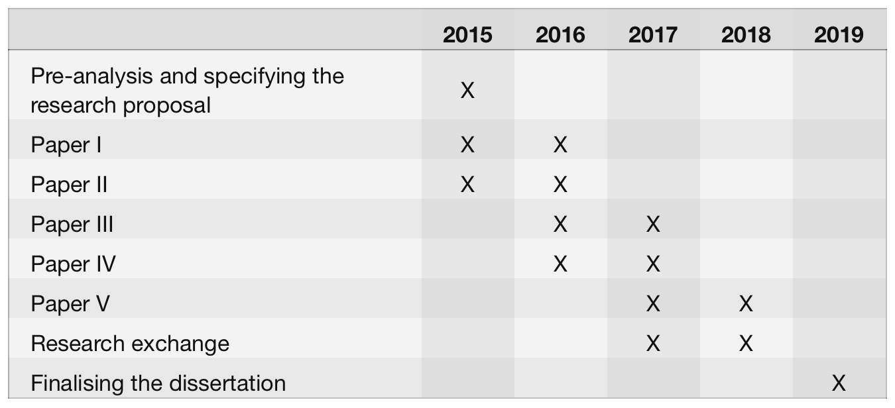

## Connected City
Open science approach for supporting evidence-based urban planning and decision making.

**Research plan for doctoral thesis [DRAFT 9.2.2015](#)**
> Antti Poikola
> Helsinki Institute for Information Technology
> Espoo, Finland
> antti.poikola@hiit.fi
> 
> Text can be commented in [Google Document](http://bit.ly/poikola_research_plan)

### Abstract
The complexity and diversity of cities and the hard to measure human social interactions in the cities makes it a daunting task for the scientific community to develop integrated, quantitative and predictive urban theory. In recent years the quest for explanatory urban theory has  speeded up with hopes for using massive data sets revealing the urban human social networks, but the unified theory of cities is still far from being complete and more comparative studies are needed to verify and reproduce the findings. Data is in the key role: it needs to be shared. Much of it can be found as open data, but perhaps the most important data sets belong to the domain of personal data. My contribution is to first develop methods for data curation inside the open science framework for urban data sets and then taking the data into action in urban planning and policy.

### 1. Introduction to the research topic and literature review

#### Human activity as the defining component of cities
The early 1960’s witnessed the appearance of works in urban theory that criticised earlier modernist planning practices for focusing mainly on aesthetics and form of city with no regard for social fabric that sustains urban development. In *“Death and Life of Great American Cities”* Jane Jacobs notes that cities are complex systems whose infrastructural, economic and social components are strongly interrelated and therefore difficult to understand in isolation (Jacobs, 1961). Alexander emphasised the relevance of social interactions as drivers of urban development and explicitly situated human activity as the defining component of cities (Alexander, 1965).

#### Scaling laws in cities
Despite their diversity the cities seem to manifest some universal, quantifiable features. Some features such as amount of housing naturally scale linearly with the population, but some features scale sub-linearly showing the *“economy of scale”* -effect. For example, doubling the population of any city requires only about an 85% increase in infrastructure, whether that be total road surface, length of electrical cables, water pipes or number of petrol stations. Interestingly the features that are connected to human social interaction seem to grow super-linearly with city size. On average, as city size increases, per capita socio-economic quantities such as wages, GDP, number of patents produced and number of educational and research institutions all increase by approximately 15% more than the expected linear growth. There is, however, a dark side: negative metrics including crime, traffic congestion and incidence of certain diseases all increase following the same 15% rule. Theoretical work suggests that the origin of this superlinear scaling pattern stems from the network of human interactions - in particular from increase in social connectivity per capita with city size. (Bettencourt and West, 2010)

#### Science of networks
Michael Batty argues that the networks of human interactions are considerably more important to our understanding and planning of cities than are locations (Batty, 2013). Both social networks and spatial location based networks can be analysed by applying the network theory (Barabási, 2002). In modern sociology analysing social relationships in terms of network theory has emerged a key technique.

In urban studies the network metaphor has a long tradition particularly when dealing with spatial networks such as transportation and mobility. After the seminal work of Hillier and Hanson (Hillier and Hanson, 1984), a rather consistent application of the network approach to cities, neighbourhoods, streets and even single buildings, has been developed under the notion of "space syntax", establishing a correlation between the topological accessibility of streets and phenomena as diverse as their popularity, human way-finding, safety against criminality, retail commerce vitality, activity separation and pollution. (Porta et al 2006)

#### Data driven research of social interaction in cities
Traditional methods for capturing social networks - for example through surveys - are time-consuming and limited in scope. However, the availability of new Big data capturing tools and large-scale data sets, such as those automatically collected from mobile phone networks and social media sites provide researcher and developers huge amount of data about people's daily behavior. Recently data driven approaches outside the computer science disciplines has gained popularity. Examples are computational sociology (Lazer et al 2009), social physics (Pentland, 2014) and digital humanities (Gold, 2012). 

Data driven approaches and network science can be used to study how ideas are flowing and how people are changing their behavior. Many aspects of human behavior are more related to the frequency of interaction and their position in the network than to the content of communication. In his book “Social physics” Pentland refers to Granovetter's well-known theory of weak ties (Granovetter, 1973). To get new ideas, you have to go outside your near community (strong ties) and meet different people in new situations (weak ties). People tend to bind strong ties to people who are similar and if you communicate only with similar people, same "truths" are circulated and repeated.

The data driven approaches open up possibilities for the systematic study of the urban social dynamics and organisation. The hope is that we can develop better cities and societies if we know better how people in fact behave; how they communicate, where they shop, how they move, where they meet each other etc. Central to the success of cities is the density of human interaction and how it facilitates the information flow and learning. As Edward Glaecer puts it “Cities enable the collaboration that makes humanity shine most brightly” (Glaecer, 2010).

### 2. Objectives and methods

My thesis will consist of a summary and five scientific articles aimed at international peer-reviewed journals. I will be the principal author in most of the papers. The planned papers are divided in groups based on their objectives.

**Objective 1: Open and reproducible urban science**
Science is built on data: its collection, analysis, publication, reanalysis, critique, and reuse. The more data is made openly available in a useful manner, the greater the level of transparency and reproducibility and hence the more efficient the scientific process becomes. This viewpoint is gaining attention among many funders, publishers, scientists, and other stakeholders in research (Molloy, 2011).

1. **Open science** methodology can accelerate scientific process and make the results easier to apply in planning and decision making. *How open is the field of urban studies currently?*
2. **Open data** published by the cities is becoming valuable source for urban research, especially data related to public transportation is widely opened in standard format. *How can open data be efficiently used in the study of urban networks?* 
3. **Personal data** such as mobile phone data offer vast opportunities for understanding social interaction in cities. Access to such data (often held by private companies) and maintaining privacy of individuals are hard challenges to be solved. *How privacy of individuals can be maintained while doing open reproducible science?* 

**Objective 2: Actionable tools to urban development**
A longstanding preoccupation of urban researchers has been the utility of research to inform real life urban planning and policy. It is helpful to make clear distinction between positive and normative perspectives on the world. Positive thinking focuses on factual evidence and is descriptive (“what is”), while normative thinking incorporate the opinions and underlying morals and is therefore prescriptive (“what should be”). Planning and policy making are mainly normative activities, which can be informed by positive theory (Harris, 1983). Scientific research often involves both positive and normative elements (Páez et al. 2012).

1. **Spatial and topological metrics of human interaction in cities** are positive (“what is”) indicators, which can potentially be used to inform planners and policy makers. *What are the key metrics that can be observed in robust way and compared between areas?* 
2. **Urban planning and policy** is normative (“what should be”) action in complex political and economical reality involving many individuals and groups with different opinions. *How scientific knowledge on human interaction in cities can be put into practice in reality?*

##### Open science
The open science movement is driven by recognition that all research is made more challenging by lack of access to research outputs including articles and data as well as intermediary information such as detailed protocols, code and raw data (Whyte and Pryor, 2011). On the other hand, when barriers are broken down, great progress can be made very rapidly. For example, the Human Genome Project is a clear demonstration of open sharing of data leading to incredible advances in biology in short time and huge economic benefits (Tripp & Grueber, 2011). Beside accelerating scientific discovery and making research mores reproducible open science makes scientific research, data and dissemination accessible to all levels of an inquiring society, amateur or professional.

> **Paper 1:** Survey on contemporary urban science literature - how open and reproducible it is?

##### Open data
Cities are now also making urban data freely available to the public. These data can have a transformative effect in research. According to Barbosa et al (2014) most of the published urban data sets are structured formats and the volume of data is increasing steadily which indicates that the open data trend is here to stay. Nonetheless, there is substantial heterogeneity across the data sets; many different terms are used for a given attribute, and a given term can be used to represent different concepts. Better tools and data standards are needed to locate relevant data and simplify analyses that require data from multiple cities. (Barbosa et al 2014)

> **Paper 2:** Developing open tools and methods for comparative urban studies - how open data can used in the study of urban networks?

##### Personal data
Extracting maximal scientific value from open data is mostly a technical problem. However, big part of the scientifically interesting data can never be open since it is originated from individuals and therefore personal and private by nature. There are sticky legal and ethical issues around the privacy and consent of research subjects. Further more some of the most scientifically valuable data are proprietary (e.g., mobile phone and financial transactional data). Robust models of collaboration and data sharing between industry such as tele operators and the academy need to be developed; guarding both the privacy of individuals as well as corporations' legitimate interests (Lazer et al 2009).

At HIIT there is on going research focusing on My Data, which is human centric approach on personal data management. It basically refers to a data infrastructure where people have accounts that contain information about all their data sources (hosted by different organisations) and rules on how individual allows delegating this data to other organisations and applications for legal use.

> **Paper 3:** My Data approach on studying large databases of personal data - how privacy of individuals can be maintained while doing open reproducible science? 

##### Spatial and topological metrics of human interaction in cities
In networks higher density of relationships (ties) facilitate the information flow and therefore it is suggested that population density, rather than population size would be at the root of the extraordinary nature of urban centers (Pan et al 2013). Population density is reasonably good proxy for the density of relationships when the latter is harder to measure empirically. There is universal agreement on the fact that populations interact with one another less as the distance increases between them, but the exact relationship between these two variables is unclear (Scellato et al 2011). Denser urban areas (shorter distances between people and places) as well as better urban accessibility (less travel time also in the case of greater physical distances) make it easier and more probable to create relationships. What else contributes to the creation of relationships? Is it possible to have really dense and busy streets that are actually poor in relationships?

> **Paper 4:** Urban vital signs - what are the key metrics of human interaction that can be observed in robust way and used as indicators for planning and policy making?

##### Urban planning and policy
Decision making in the cities political and economical reality is always complicated. In order to have impact the scientific findings need to be polished to the level of understandable tools and concepts that the citizens, policy makers and planners are able and willing to use. In the final part of my dissertation my aim is to study evidence-based practice (Krizek et al. 2009) in urban planning and policy.

> **Paper 5:** Field study on the implementation of the metrics in urban decision making - how scientific knowledge on human interaction in cities can be put into practice?

### 3. Ethical questions
The use of large data sets and social network analysis in urban research raises important questions about ethics and privacy. Protecting privacy of individuals is even more challenging when the aim is to create reproducible open science, which means publishing also the research data openly. Central part of my dissertation (My Data) focuses on ethically sustainable and privacy aware way of using personal data for research.

Other perhaps less prominent ethical questions relate to the outcomes of the research. Anthony M. Townsend warns about technology enthusiasm by reminding how in the 1930s modernist planners began rebuilding cities around a new technology, the automobile, without considering the potential negative effects. Today the “Data enthusiasm” is fueling the new scientific interest in cities. But even the biggest urban datasets are likely to prove incomplete and trying to understand the behaviour of something as complex as a city solely by computing large masses of data may not lead to best outcomes. (Townsend, 2013)

It is crucially important to set question right - what do we want to optimise in a city? Gains in efficiency often lead to “rebound” consumption. For example the cities may be greener since they offer a means of living that involves less driving and smaller homes to heat and cool (Glaeser, 2011), but at the same time city dwellers are are earning more and consuming other goods more which may cancel the positive “green” effect.

### 4. Schedule and research environment

*Table 1: Preliminary schedule of completing PhD dissertation*

*Table 2:Preliminary study plan*
TBC  

**Funding for the studies**
Funding for this research is fully granted for the year of 2015 from two TEKES projects namely: *[Digital Health Revolution](www.digitalhealthrevolution.fi/)* and *[Revolution of Knowledge Work](http://reknow.fi/)*. Further funding for my PhD studies will be applied later on. I have planned to join to *[DENVI](http://www.helsinki.fi/henvi/denvi/)* (Doctoral Program in interdisciplinary Environmental sciences) as my postgraduate school after I have received a right to pursue PhD studies at the University of Helsinki.

**Supervision**
Principal supervisor for my thesis will be Ph.D. Tuuli Toivonen (*[Helsinki University](http://www.helsinki.fi/geo/)*) who has great expertise of the topics covered in this research. Ph.D. Marko Turpeinen ([*HIIT*](http://hiit.fi/)) will be supporting supervisor who will monitor the progress of my PhD thesis and studies.

### 5. References

**Barabási**, Albert-László. 2002. Linked: The New Science of Networks. Perseus Books Group.
**Barbosa**, Luciano, Kien Pham, Claudio Silva, Marcos R. Vieira, and Juliana Freire. 2014. “Structured Open Urban Data: Understanding the Landscape.” Big Data 2 (3): 144–54.
**Batty**, Michael. 2013. The New Science of Cities. Mit Press.
**Bettencourt**, Luis, and Geoffrey West. 2010. “A Unified Theory of Urban Living.” Nature 467 (7318): 912–13. doi:10.1038/467912a.
**Glaeser**, Edward. 2011. Triumph of the City: How Our Greatest Invention Makes Us Richer, Smarter, Greener, Healthier, and 

**Hansel**

**Happier**. Penguin Group US.
**Granovetter**, Mark S. 1973. “The Strength of Weak Ties.” American Journal of Sociology, 1360–80.
**Harris**, Britton. 1983. “Positive and Normative Aspects of Modelling Large-Scale Social Systems.” In Systems Analysis in Urban Policy-Making and Planning, 475–90. Springer.
**Jacobs**, Jane. 1961. The Death and Life of Great American Cities. Vintage Books.
**Krizek**, Kevin, Ann Forysth, and Carissa Schively Slotterback. 2009. “Is There a Role for Evidence-Based Practice in Urban Planning and Policy?” Planning Theory & Practice 10 (4): 459–78.
**Lazer**, David, Alex (Sandy) Pentland, Lada Adamic, Sinan Aral, Albert Laszlo Barabasi, Devon Brewer, Nicholas Christakis, et al. 2009. “Life in the Network: The Coming Age of Computational Social Science.” Science (New York, N.Y.) 323 (5915): 721–23. doi:10.1126/science.1167742.
**Molloy**, Jennifer C. 2011. “The Open Knowledge Foundation: Open Data Means Better Science.” PLoS Biology 9 (12). doi:10.1371/journal.pbio.1001195.
**Páez**, Antonio, Darren M. Scott, and Catherine Morency. 2012. “Measuring Accessibility: Positive and Normative Implementations of Various Accessibility Indicators.” Journal of Transport Geography 25: 141–53.
**Pan**, Wei, Gourab Ghoshal, Coco Krumme, Manuel Cebrian, and Alex Pentland. 2013. “Urban Characteristics Attributable to Density-Driven Tie Formation.” Nature Communications 4 (June). doi:10.1038/ncomms2961.
**Pentland**, Alex. 2014. Social Physics: How Good Ideas Spread-The Lessons from a New Science. Penguin.
**Porta**, Sergio, Paolo Crucitti, and Vito Latora. 2006. “The Network Analysis of Urban Streets: A Primal Approach.” Physica A: Statistical Mechanics and Its Applications 369 (2): 853–66. doi:10.1016/j.physa.2005.12.063.
**Scellato**, Salvatore, Anastasios Noulas, Renaud Lambiotte, and Cecilia Mascolo. 2011. “Socio-Spatial Properties of Online Location-Based Social Networks.” ICWSM 11: 329–36.
**Schläpfer**, Markus, Luis M. A. Bettencourt, Sebastian Grauwin, Mathias Raschke, Rob Claxton, Zbigniew Smoreda, Geoffrey B. West, and Carlo Ratti. 2012. “The Scaling of Human Interactions with City Size.” arXiv:1210.5215 [physics](#), October. http://arxiv.org/abs/1210.5215.
**Townsend**, Anthony M. 2013. Smart Cities: Big Data, Civic Hackers, and the Quest for a New Utopia. WW Norton & Company.
**Tripp**, S., and M. Grueber. 2011. “Economic Impact of the Human Genome Project.” Battelle Memorial Institute.
**Whyte**, Angus, and Graham Pryor. 2011. “Open Science in Practice: Researcher Perspectives and Participation.” International Journal of Digital Curation 6 (1): 199–213. doi:10.2218/ijdc.v6i1.182.